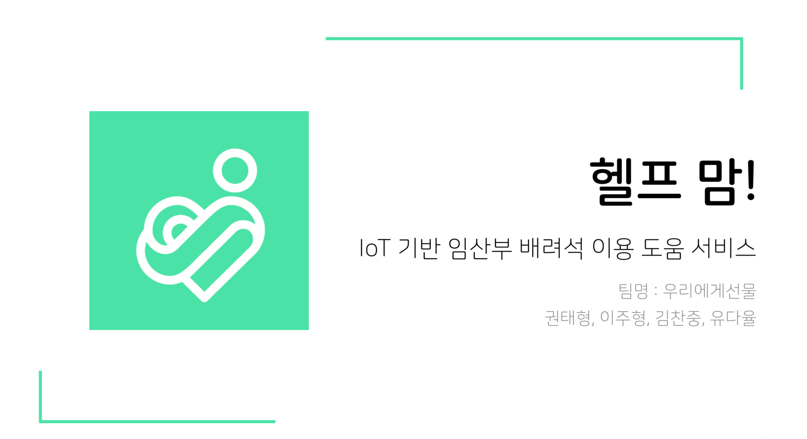

# 헬프맘(Helpmom)

## Intro
 - IOT를 기반으로 임산부 배려석 이용에 도움을 주는 앱서비스입니다.
 - It helps pregnant women to use priority seat.

**기획배경 :** 
1. 임산부들의 임산부 배려석 이용 어려움
2. 기존의 해결방안인 핑크라이트와 핑크배지는 양보를 요구해야하는, 수동적인 방법이기에 효과가 미미함
   핑크배지 : 눈에 잘 띄지않아 배려받기 어려움
   핑크라이트 : 지하철 소리에 묻혀 메세지가 들리지않음
3. 임산부들은 타인에게 배려를 강요하는 느낌이 들어 심적으로 불편함

**기대효과:**
1. 임산부석은 비워두어야한다는 사회문화 조성
2. 직접 양보를 요구하지않아도 되므로 편안하게 이용가능
3. 기존 핑크라이트보다 단가가 저렴
4. 사업타겟이 확실하여 서울 외 지역에도 확장 가능

## Developer

- Guinness
- TaeBbong

## Tech Stack

Hardware : Arduino 
APP: Android Java Native
Server: PHP
DB: MYSQL
Hosting: Cafe24

## How to use?
Use with App (Repository= https://github.com/TaeBbong/HelpMom)
